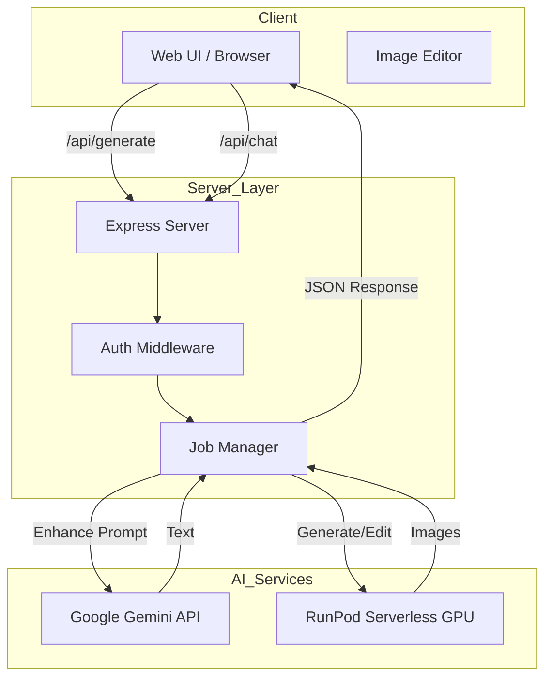
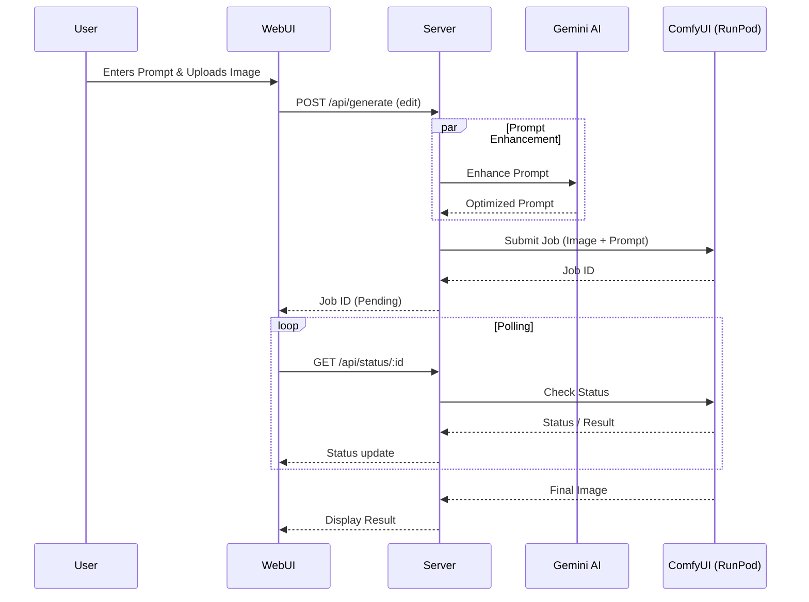

# ComfyUI Image Editing + Gemini - WebUI - Cloud serverless GPU/VPS

AI-powered image editing service using **Qwen-based workflows** on RunPod and **Google Gemini** for prompt enhancement.

## �️ Interfaces

| Interface | Description | Status |
|-----------|-------------|--------|
| **[Image Editor](public/test-edit.html)** | **Main Interface**. Interactive AI image editing using Qwen workflow. | ✅ Production |
| **[Content Pipeline](public/modern.html)** | "Conveyor Belt" prototype for batch content creation (Idea -> Video). | 🚧 Prototype |
| **[Studio Dashboard](public/index.html)** | Classic chat & generate interface with Gemini integration. | ✅ Stable |

## 📸 Screenshots


<!-- Create a 'docs' folder and add your screenshots there. Uncomment below to display. -->

<!-- 
### Image Editor (Main)


### Content Pipeline (Prototype)

-->

## ✨ Operations
- **AI Editing**: Replace/modify objects in images using natural language.
- **Prompt Engineering**: Use Gemini to expand simple ideas into professional prompts.
- **Cloud Backend**: Serverless GPU execution via RunPod (no local GPU required).
- **Production Ready**: Built-in rate limiting, logging, and PM2 support.

## 🚀 Quick Start

1. **Install Dependencies**
   ```bash
   npm install
   ```

2. **Configure Environment**
   ```bash
   cp .env.example .env
   # Set GEMINI_API_KEY, RUNPOD_API_KEY, RUNPOD_ENDPOINT_ID
   ```

3. **Run Locallly**
   ```bash
   npm run dev
   # Open http://localhost:3000
   ```

## 📦 Deployment (VPS)

1. **Setup PM2**: `npm install -g pm2`
2. **Start Server**: `pm2 start ecosystem.config.js`
3. **Docs**: See [DEPLOYMENT.md](./DEPLOYMENT.md) for full Nginx/HTTPS setup.

## � Configuration

**Required `.env` Variables**:
- `GEMINI_API_KEY`: Google AI Studio key.
- `RUNPOD_API_KEY`: API Key from RunPod.
- `RUNPOD_ENDPOINT_ID`: Endpoint ID for your deployed ComfyUI workflow.

*Default Port: 3000 (Set `PORT` to change)*

## 🏗️ Architecture



### 🔄 Workflow: Image Editing


## 📝 License
MIT
